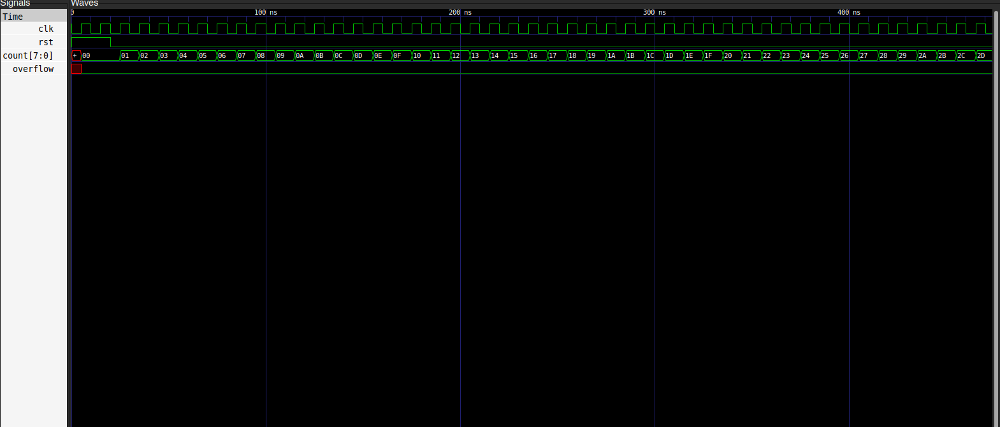
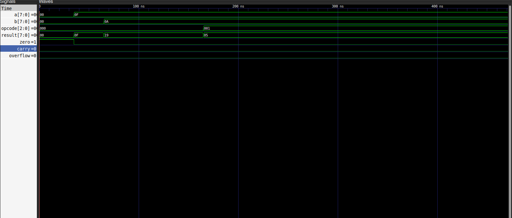
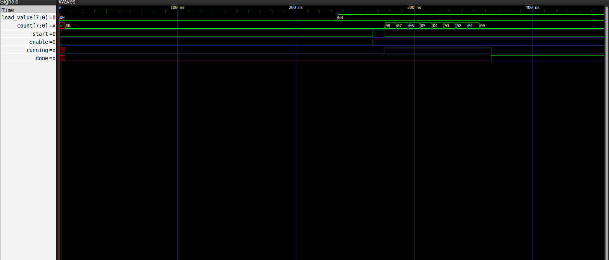
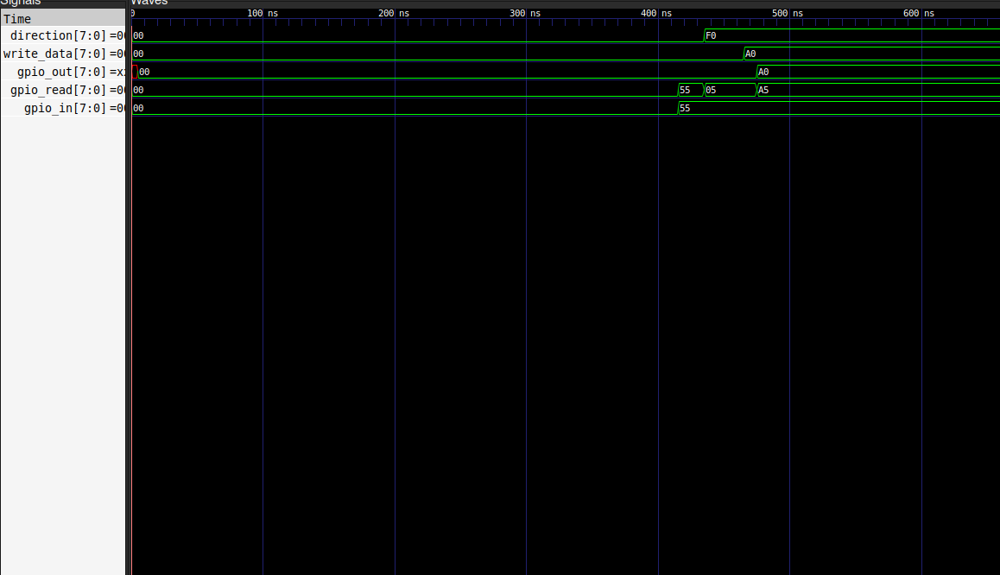
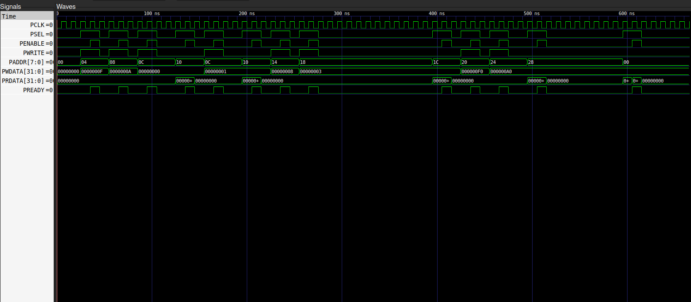
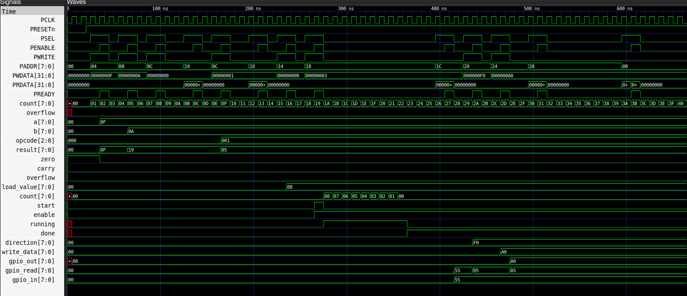

# Mini SoC v2 using Verilog HDL

## Overview

This project demonstrates the design and verification of a **Mini System-on-Chip (Mini SoC)** using **Verilog HDL**. The SoC integrates multiple reusable Intellectual Property (IP) blocks connected through an **AMBA APB (Advanced Peripheral Bus)** interface.

The project was developed to understand RTL design, modular IP integration, APB communication, and functional verification using simulation.

---

## Features

* Modular RTL Design
* Parameterized 8-bit Counter
* 8-bit Arithmetic Logic Unit (ALU)
* Countdown Timer IP
* General Purpose Input Output (GPIO) Controller
* APB3 Slave Interface
* Top-Level SoC Integration
* Functional Verification using Testbenches
* GTKWave Waveform Analysis

---

## SoC Architecture/Block diagram

<p align="center">

</p>

---


## Project Structure

```
mini_soc_v2
│
├── rtl/
│   ├── counter.v
│   ├── alu.v
│   ├── timer.v
│   ├── gpio.v
│   ├── apb_slave.v
│   └── mini_soc.v
│
├── tb/
│   ├── counter_tb.v
│   ├── alu_tb.v
│   ├── timer_tb.v
│   ├── gpio_tb.v
│   └── mini_soc_tb.v
│
├── scripts/
│   └── run_soc.sh
│
├── images/
│
└── README.md
```

---

## RTL Modules

### Counter

* 8-bit synchronous up counter
* Enable control
* Overflow indication
* Parameterized width

---

### ALU

Operations Supported:

| Opcode | Operation   |
| ------ | ----------- |
| 000    | Addition    |
| 001    | Subtraction |
| 010    | AND         |
| 011    | OR          |
| 100    | XOR         |
| 101    | NOT         |
| 110    | Shift Left  |
| 111    | Shift Right |

Outputs:

* Result
* Zero Flag
* Carry Flag
* Overflow Flag

---

### Timer

* Countdown timer
* Start signal
* Enable control
* Running status
* Done flag

---

### GPIO

* 8-bit GPIO
* Direction Register
* Output Register
* Input Register
* Read/Write support

---

### APB Slave

The APB Slave provides register access to all peripherals.

### Memory Map

| Address | Register       |
| ------- | -------------- |
| 0x00    | Counter Value  |
| 0x04    | ALU Operand A  |
| 0x08    | ALU Operand B  |
| 0x0C    | ALU Opcode     |
| 0x10    | ALU Result     |
| 0x14    | Timer Load     |
| 0x18    | Timer Control  |
| 0x1C    | Timer Status   |
| 0x20    | GPIO Direction |
| 0x24    | GPIO Output    |
| 0x28    | GPIO Input     |

---

## Simulation Flow

```
Testbench

↓

APB Transactions

↓

Mini SoC

↓

Counter
ALU
Timer
GPIO

↓

Waveforms
```

---

## Waveforms

### Counter

<p align="center">

</p>

---

### ALU

<p align="center">

</p>

---

### Timer

<p align="center">

</p>

---

### GPIO

<p align="center">

</p>

---

### APB Transaction

<p align="center">

</p>

---

### Complete Mini SoC Simulation

<p align="center">

</p>

---

## Tools Used

* Verilog HDL
* Icarus Verilog
* GTKWave
* Verilator (explored during development)
* Git
* GitHub
* Ubuntu Linux

---

## Learning Outcomes

Through this project I learned:

* RTL Design using Verilog HDL
* Modular IP Design
* APB Protocol Basics
* IP Integration
* Register-Based Peripheral Design
* Functional Verification
* Waveform Debugging
* SoC Architecture Fundamentals
* Git Version Control

---

## Future Improvements

* APB Master implementation
* UART Peripheral
* PWM Controller
* Interrupt Controller
* Memory-Mapped Register File
* APB Decoder
* APB Interconnect
* UVM-based Verification
* FPGA Implementation

---

## Author

**Mihir Suthar**

Electronics and Communication Engineering Student

Interested in RTL Design, Digital Design, Embedded Systems and VLSI.

Connect with me on LinkedIn : https://www.linkedin.com/in/sutharmihir/ and feel free to share suggestions or feedback.
